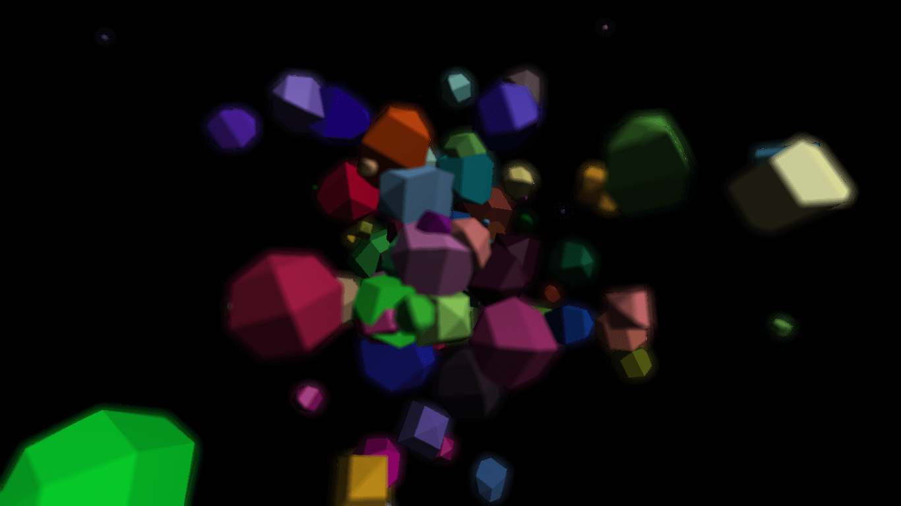
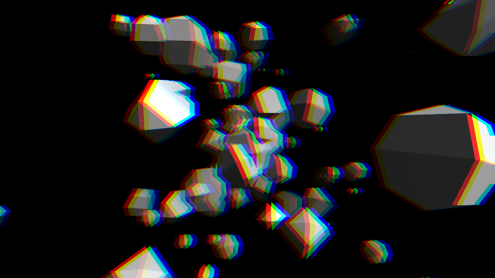
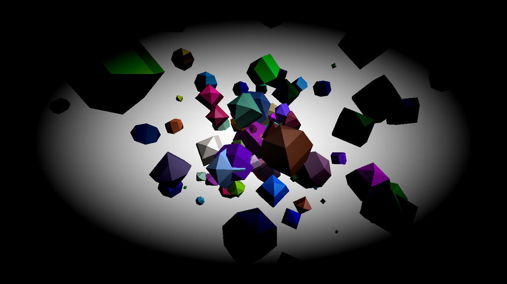

### 后处理基础包
* **EffectComposer.js**

效果组合对象， 在该对象上可以添加后期处理通道，使用它来渲染场景、应用通道和输出结果。  

**引用**：js/postprocessing/EffectComposer.js  
**参数**：  
`renderer`，是WebGLRenderer对象  
`rendererTarget`，可选，渲染缓冲区域对象  
**方法**：composer.render()，可选参数,time，时间，如Date.now()  
**用法示例**：
```javascript
composer = new THREE.EffectComposer(renderer);

//其他用法：
var rendererTarget = new THREE.WebGLRenderTarget(window.innerWidth, window.innerHeight, {
    // minFilter:THREE.LinearFilter,
    // magFilter:THREE.LinearFilter,
    // format:THREE.RGBFormat,
    // stencilBuffer:true//渲染到模板缓冲区。默认true.
});
composer = new THREE.EffectComposer(renderer, rendererTarget);
```

### 后处理通道包

* **RenderPass.js**

该通道会在当前场景和摄像机的基础上渲染出一个新场景，和普通的webGLRenderer一样。  

**引用**：js/postprocessing/RenderPass.js  
**参数**：  
`scene`，场景对象  
`camera`，相机对象  
**属性**：  
`enabled`，开启通道，默认为true，设置为false，则通道关闭，一般通道都有该属性  
`clear`，清除渲染，默认为true，设置false，可以避免影响其他后通道的使用  
**用法示例**：
```javascript
var renderPass = new THREE.RenderPass(scene, camera);
composer.addPass(renderPass);
renderPass.clear = false;
```

* **ShaderPass.js**

该通道接受自定义的着色器作为参数，以生成一个高级、自定义的后期处理通道, 产生各种模糊效果和高级滤镜。  

**引用**：js/postprocessing/ShaderPass.js  
**参数**：各种threejs内置着色器包或自定义着色器  
- THREE.DotScreenShader：输出灰度点集
- THREE.MirrorShader：创建镜面效果
- THREE.HueSaturationShader：改变颜色的色调和饱和度
- THREE.VignetteShader：添加晕映效果
- THREE.ColorCorrectionShader：调整颜色的分布
- THREE.RGBShiftShader：将红绿蓝三种颜色分开
- THREE.BrightnessContrastShader：改变亮度和对比度
- THREE.ColorifyShader：将某种颜色覆盖到整个屏幕
- THREE.SepiaShader：创建类似于乌贼墨的效果
- THREE.KaleidoShader：类似于万花筒的效果
- THREE.LuminosityShader：提高亮度
- THREE.TechnicolorShader：模拟类似老电影里面的两条彩色效果
- THREE.HorizontalBlurShader和THREE.VerticalBlurShader：可以向水平和垂直方向创建模糊效果
- THREE.HorizontalTiltShiftShader和THREE.VerticalTileShiftShader：可以在水平和垂直方向创建倾斜平移的效果
- THREE.TriangleBlurShader：基于三角形的方法创造一种模糊效果
- THREE.BleachBypassShader：创造一种镀银的效果
- THREE.EdgeShader：找到图片的边界并显示
- THREE.FXAAShader：添加抗锯齿的效果
- THREE.FocusShader：创建中间比较尖锐，周围比较模糊的效果。

**用法示例**：
```javascript
var dotScreenShader = new THREE.ShaderPass(THREE.DotScreenShader);
dotScreenShader.uniforms['scale'].value = 4;
composer.addPass(dotScreenShader);
```

* **AfterimagePass.js**

该通道可以让通道场景内的物体在运动时，产生残影效果。使用时需要引入相对应的着色器包（js/shaders/AfterimageShader.js）。

**引用**：js/postprocessing/AfterimagePass.js  
**参数**：无  
**用法示例**：
```javascript
afterimage = new THREE.AfterimagePass();
composer.addPass(afterimage);
afterimage.uniforms["damp"].value = 0.97;
```
[demo](https://hafly.github.io/three.js-postprocessing/examples/AfterimagePass.html?_blank)  


* **BloomPass.js**

该通道会增强场景中的亮度。

**配置项**：  
`Strength`：光的强度
`kernelSize`：光的偏移
`sigma`：光的锐利程度
`Resolution`：光的精确度，值越低，光的方块化越严重  
**用法示例**：
```javascript
var renderPass = new THREE.RenderPass(scene, camera);
var effectCopy = new THREE.ShaderPass(THREE.CopyShader);
// CopyShader是为了能将结果输出，普通的通道一般都是不能输出的，要靠CopyShader进行输出
effectCopy.renderToScreen = true;// 设置这个参数的目的是马上将当前的内容输出

var bloomPass = new THREE.BloomPass(3, 25, 5.0, 256);

composer1.addPass(renderScene); // 渲染当前场景
composer1.addPass(bloomPass);   // 添加光效
composer1.addPass(effectCopy);  // 输出到屏幕
```
[demo](https://hafly.github.io/three.js-postprocessing/examples/BloomPass.html?_blank)


* **UnrealBloomPass.js**

该通道会产生类似于虚幻引擎的效果，需搭配对应的着色器包使用（js/shaders/LuminosityHighPassShader.js）。

**引用**：js/postprocessing/UnrealBloomPass.js  
**参数**：  
`vec2`,2维分量，作用范围  
`strength`，光晕强度，默认为1  
`radius`，光晕半径  
`threshold`，光晕阈值，值越小，效果越明显  
**用法示例**：
```javascript
unrealBloomPass = new THREE.UnrealBloomPass(new THREE.Vector2(window.innerWidth, window.innerHeight), 1.0, 0.5, 0.1);
composer.addPass(unrealBloomPass);

gui.add(settings, "strength", 0.0, 3.0).name("光晕强度").onChange(function (e) {
    unrealBloomPass.strength = e;
});
gui.add(settings, "threshold", 0.0, 1.0).name("光晕阈值").onChange(function (e) {
    unrealBloomPass.threshold = e;
});
gui.add(settings, "radius", 0.0, 1.0).name("光晕半径").onChange(function (e) {
    unrealBloomPass.radius = e;
});
```
[demo](https://hafly.github.io/three.js-postprocessing/examples/UnrealBloomPass.html?_blank)


* **BokehPass.js**

该通道可以设置背景虚化程度，类似相机变焦产生的效果。

**引用**：js/postprocessing/BokehPass.js  
**参数**：  
`scene`，场景对象  
`camera`，相机对象  
options，{  
&emsp;&emsp;focus，焦距，调整远近，对焦时才会清晰  
&emsp;&emsp;apertrue，孔径，类似相机孔径调节  
&emsp;&emsp;maxblur，最大模糊程度  
}   
**用法示例**： 
```javascript
bokehPass = new THREE.BokehPass(scene, camera, {
    focus: 500,
    aperture: 5 * 0.00001,
    maxblur: 1.0,

    width: window.innerWidth,
    height: window.innerHeight
});
composer.addPass(bokehPass);

gui.add(settings, "focus", 10, 3000, 10).name("焦距").onChange(function (e) {
    bokehPass.uniforms['focus'].value = e;
});
gui.add(settings, "aperture", 0, 10, 0.1).name("孔径").onChange(function (e) {
    bokehPass.uniforms['aperture'].value = e * 0.00001;
});
gui.add(settings, "maxblur", 0, 3, 0.025).name("最大模糊").onChange(function (e) {
    bokehPass.uniforms['maxblur'].value = e;
});
``` 
[demo](https://hafly.github.io/three.js-postprocessing/examples/BokehPass.html?_blank)  


* **FilmPass.js**

该通道会使用扫描线和失真来模拟电视屏幕效果。

**配置项**：  
`noiseIntensity`：场景的粗糙程度  
`scanlinesIntensity`：扫描线的显著程度  
`scanLinesCount`：扫描线的数量  
`gratScale`：是否使用灰度图输出  
[demo](https://hafly.github.io/three.js-postprocessing/examples/FilmPass.html?_blank)  


* **GlitchPass.js**

该通道会随机在屏幕上显示电脉冲。使用时需要引入对应的着色器包（js/shaders/DigitalGlitch.js）。

**引用**：js/postprocessing/GlitchPass.js  
**参数**：无  
**属性**：  
goWild，默认为false，为true则会持续显示全屏电子脉冲
**用法示例**：  
[demo](https://hafly.github.io/three.js-postprocessing/examples/GlitchPass.html?_blank)  


- ClearPass.js

清除背景通道，设置背景颜色等。  

**引用**：js/postprocessing/ClearPass.js
**参数**：  
`clearColor`，背景颜色，默认0  
`clearAlpha`，背景透明度，默认0  
**用法示例**：  
```javascript
clearPass = new THREE.ClearPass('white', 1.0);
composer.addPass(clearPass);
```
- TexturePass.js

纹理贴图通道，如设置背景贴图。

**引用**：js/postprocessing/TexturePass.js  
**参数**：  
texture，Texture纹理对象  
**属性**：  
map，等同于直接在构造函数中赋值  
opacity，贴图透明度，默认1，范围0-1  
**用法示例**：  
```javascript
var texture = new THREE.TextureLoader().load('textures/mask1.jpg');
texture.minFilter = THREE.LinearFilter;
var texturePass = new THREE.TexturePass(texture);
composer.addPass(texturePass);

texturePass = new THREE.TexturePass();
composer.addPass(texturePass);
new THREE.TextureLoader().load("textures/hardwood2_diffuse.jpg", function (map) {
    texturePass.map = map;
});
```
- CubeTexturePass.js

立方体盒子（天空盒子）贴图通道，设置全景贴图。

**引用**：js/postprocessing/CubeTexturePass.js  
**参数**：  
`camera`，相机对象  
**属性**：  
`envmap`，全景贴图，六张图片  
`opacity`，透明度  
`enabled`，是否开启通道，默认为true  
**用法示例**：  
[demo](https://hafly.github.io/three.js-postprocessing/examples/Background.html?_blank)  


* **HalftonePass.js**

该通道可以给场景添加RGB三色效果，并且可以设置参数调节，需搭配对应着色器使用（js/shaders/HalftoneShader.js）。

**引用**：js/postprocessing/HalftonePass.js  
**参数**：  
`width`，覆盖宽度，  
`height`，覆盖长度  
`para`，各配置项  


* **OutlinePass.js**

该通道可以为物体（场景中被添加到通道中的物体）的边缘添加一个发光效果。

**引用**：js/postprocessing/OutlinePass.js  
**参数**：  
`vec2`，一个2维分量，表示效果范围  
`scene`，场景对象  
`camera`，相机对象  
**配置项**：  
`edgeStrength`：边缘强度 ，默认3.0，最基础的属性，后面4个配置项都基于该项  
`edgeGlow`：边缘流， 默认0.0  
`edgeThickness`：边缘厚度，默认1.0  
`pulsePeriod`：闪烁频率 ，默认0 ，值越大频率越低  
`usePatternTexture`：选中对象使用图案纹理，默认false，不使用  
`visibleEdgeColor`：边缘可见部分发光颜色，默认#FFFFFF  
`hiddenEdgeColor`：边缘遮挡部分发光颜色，默认#190A05  
`selectedObjects`，一个对象数组，表示使用该效果的对象  
**用法示例**：  
```javascript
outlinePass = new THREE.OutlinePass(new THREE.Vector2(window.innerWidth, window.innerHeight), scene, camera);
composer.addPass(outlinePass);

// 添加纹理             
new THREE.TextureLoader().load("textures/disturb.jpg", function (texture) {
    outlinePass.patternTexture = texture;
    texture.wrapS = texture.wrapT = THREE.RepeatWrapping;
});
// 添加物体对象
outline_objects.push(obj);
outlinePass.selectedObjects = outline_objects;

// 使用dat.GUI测试
outline.add(settings, "edgeStrength", 0.01, 10).name("边缘强度").onChange(function (e) {
    outlinePass.edgeStrength = e;
});
outline.add(settings, "edgeGlow", 0.0, 1.0).name("边缘流").onChange(function (e) {
    outlinePass.edgeGlow = e;
});
outline.add(settings, "edgeThickness", 1, 4).name("边缘厚度").onChange(function (e) {
    outlinePass.edgeThickness = e;
});
outline.add(settings, "pulsePeriod", 0.0, 5).name("跳动周期").onChange(function (e) {
    outlinePass.pulsePeriod = e;
});
outline.addColor(settings, "visibleEdgeColor").name("可见边缘颜色").onChange(function (e) {
    outlinePass.visibleEdgeColor.set(e);
});
outline.addColor(settings, "hiddenEdgeColor").name("隐藏边缘颜色").onChange(function (e) {
    outlinePass.hiddenEdgeColor.set(e);
});
outline.add(settings, "usePatternTexture").name("使用图案纹理").onChange(function (e) {
    outlinePass.usePatternTexture = e;
});
```
[demo](https://hafly.github.io/three.js-postprocessing/examples/OutlinePass.html?_blank)  


* **MaskPass.js**

该通道可以在当前图像上添加掩码，后续的通道只会影响掩蔽区域，并且使用完后必须清除掩码区域。

**引用**：js/postprocessing/MaskPass.js  
**参数**：  
`scene`，场景对象  
`camera`，相机对象  
**用法示例**：  
```javascript
var rendererTarget = new THREE.WebGLRenderTarget(window.innerWidth, window.innerHeight, {
    // minFilter:THREE.LinearFilter,
    // magFilter:THREE.LinearFilter,
    // format:THREE.RGBFormat,
    // stencilBuffer:true//渲染到模板缓冲区。默认true.
});// 渲染缓冲区             
composer = new THREE.EffectComposer(renderer, rendererTarget);

// 清除通道，当掩蔽物移动时，不会增大掩蔽区域，如果不添加该通道，掩蔽区域会跟着掩蔽物的移动而变大
var clearPass = new THREE.ClearPass();// 该对象在js/postprocessing/ClearPass.js包中
composer.addPass(clearPass);

var clearMaskPass = new THREE.ClearMaskPass();// 清除掩蔽物通道，该对象在js/postprocessing/MaskPass.js包中

// 立方体掩蔽物
box = new THREE.Mesh(new THREE.BoxBufferGeometry(4, 4, 4));
scene.add(box);

var maskPass = new THREE.MaskPass(scene, camera);
composer.addPass(maskPass);

var texture = new THREE.TextureLoader().load('textures/mask1.jpg');
texture.minFilter = THREE.LinearFilter;
var texturePass = new THREE.TexturePass(texture);
composer.addPass(texturePass);

composer.addPass(clearMaskPass);// 如果有多个掩码通道，每次都需要重新清除掩蔽通道

// 该通道不能直接输出效果，需求使用CopyShader输出。
// 输出通道
var outputPass = new THREE.ShaderPass(THREE.CopyShader);
composer.addPass(outputPass);
```
[demo](https://hafly.github.io/three.js-postprocessing/examples/MaskPass.html?_blank)  


### 着色器包
* **DotScreenShader.js**

该着色器会将原始图像输出为灰度点集。

**引用**：js/shaders/DotScreenShader.js  
**配置项**：  
`scale`：点的大小  
`center`：点的偏移量  
`angle`：点的对其方式  
**用法示例**：  
```javascript
var dotScreenShader = new THREE.ShaderPass(THREE.DotScreenShader);
dotScreenShader.uniforms['scale'].value = 4;
composer.addPass(dotScreenShader);
```
[demo](https://hafly.github.io/three.js-postprocessing/examples/DotScreenShader.html?_blank)


* **RGBShiftShader.js**

该着色器会将图像的红绿蓝三种颜色分离。

**引用**：js/shaders/RGBShiftShader.js  
**配置项**：  
`amount`：颜色深浅度  
**用法示例**：
```javascript
var RGBshiftShader = new THREE.ShaderPass(THREE.RGBShiftShader);
RGBshiftShader.uniforms['amount'].value = 0.0015;
composer.addPass(RGBshiftShader);
```
[demo](https://hafly.github.io/three.js-postprocessing/examples/RGBShiftShader.html?_blank)


* **LuminosityHighPassShader.js**  

该着色器主要用于物体亮度通道实现，搭配对应通道使用（js/postprocessing/UnrealBloomPass.js）  

**引用**：js/shaders/LuminosityHighPassShader.js

* **LuminosityShader**

颜色到灰度的转换

**引用**：js/shaders/LuminosityShader.js

[demo](https://hafly.github.io/three.js-postprocessing/examples/LuminosityShader.html?_blank)


* **SobelOperatorShader**

索贝尔边缘检测，给物体描边

**引用**：js/shaders/SobelOperatorShader.js

[demo](https://hafly.github.io/three.js-postprocessing/examples/SobelOperatorShader.html?_blank)


* **FXAAShader**

该着色器主要用于抗锯齿。

**引用**：js/shaders/FXAAShader.js  
**配置项**：  
`resolution`：分辨率，根据窗口设置大小  
**用法示例**：  
```javascript
// 抗锯齿着色器
effectFXAA = new THREE.ShaderPass(THREE.FXAAShader);
effectFXAA.uniforms['resolution'].value.set(1 / window.innerWidth, 1 / window.innerHeight);
composer.addPass(effectFXAA);
```

[demo](https://hafly.github.io/three.js-postprocessing/examples/FXAAShader.html?_blank)


* **FocusShader**

创建中间比较尖锐，周围比较模糊的效果

**引用**：js/shaders/FocusShader.js  

[demo](https://hafly.github.io/three.js-postprocessing/examples/FocusShader.html?_blank)


* **VignetteShader**

添加晕映效果

**引用**：js/shaders/VignetteShader.js  

[demo](https://hafly.github.io/three.js-postprocessing/examples/VignetteShader.html?_blank)


* **PixelShader**

该着色器能给场景中的物体添加马赛克效果

**引用**：js/shaders/PixelShader.js  
**配置项**：  
`resolution`，分辨率  
`pixelSize`，像素大小  
**用法示例**：  
```javascript
pixelShader = new THREE.ShaderPass(THREE.PixelShader);
composer.addPass(pixelShader);
var pixelRatio = renderer.getPixelRatio();
pixelShader.uniforms['resolution'].value = new THREE.Vector2(window.innerWidth * pixelRatio, window.innerHeight * pixelRatio);
pixelShader.uniforms['pixelSize'].value = 16;
```

[demo](https://hafly.github.io/three.js-postprocessing/examples/PixelShader.html?_blank)


[描述](www.baidu.com)